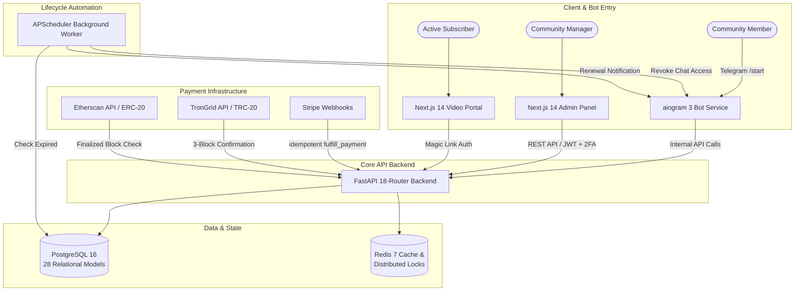

# Production Case Study: Subscription Community & Billing Engine

> **System Overview:** A production-derived membership management, billing, and access-control platform for a creator community on Telegram. The system supports recurring and manual payment flows, on-chain USDT verification, and automated membership lifecycle operations.

---

## 1. Commercial Results & Operational Impact

The product operator reported the following gross payment volume during the initial seven-day commercial-launch window:

| Currency | Operator-reported gross volume |
| :--- | ---: |
| **EUR (€)** | **€1,648** |
| **RUB (₽)** | **₽251,500** |
| **USD ($)** | **$4,306** |

The amounts are retained in their original currencies and are not converted or summed into a synthetic total. They are operator-reported rather than independently audited. Redacted payment evidence can be shared privately when customer confidentiality permits.

### Operational Scope
- **Duplicate-risk controls:** Unique provider-event tracking, idempotency keys, database constraints, and distributed lock guards protect fulfillment paths from replay and concurrency errors.
- **Automated delivery:** Verified payment events can generate time-limited Telegram channel and chat invitations without a manual grant step.
- **Lifecycle enforcement:** Background workers identify expiring or expired subscriptions, send configured renewal notices, and revoke access after the applicable grace period.
- **Self-service access:** Magic-link authentication and the member portal reduce routine operator work while preserving manual review paths for exceptions.

---

## 2. Product Architecture & Engineering Flow

---

## 3. Core Technical Capabilities

### 1. Unified Idempotent Billing Engine
- Unified `fulfill_payment()` entrypoint handles multiple disparate payment methods (Stripe subscriptions, on-chain crypto, and admin manual overrides).
- Webhook events are checked against an internal idempotency ledger before state transitions occur, reducing the risk that network retries create duplicate subscription periods or excess invite tokens.
- On-chain crypto transactions are verified directly against TronGrid and Etherscan nodes, checking receiver address, exact amount, transaction age, and requiring 3 block confirmations before granting membership.

### 2. Autonomous Membership Lifecycle
- Single-use, time-expiring Telegram invite links prevent link sharing across unauthorized users.
- Automated referral attribution (`?start=ref_<code>`) calculates custom discount rules for the invitee and credits the inviter with bonus days or tiered affiliate balances.
- Periodic background evaluation worker (`kick_expired_job`) cleans up members whose billing grace period has lapsed without manual admin intervention.

### 3. Comprehensive Administrative Control
- Real-time executive dashboard calculating MRR, churn rate, active member cohorts, and revenue by currency.
- Granular subscriber management with manual extension, pause, refund, and revocation capabilities.
- Role-based access control with TOTP-based Two-Factor Authentication (2FA).

### 4. Rigorous Test Suite
- **938 backend tests** cover router schemas, auth handlers, crypto verification, referral calculations, bot state machines, and webhook edge cases; **8 deployment-helper tests** cover operational scripts.
- External services are mocked in the backend suite, which currently completes in CI without live payment, Telegram, database, or Redis credentials.

---

## 4. Role & AI-Assisted Engineering Workflow

### What I Owned (Product & Operations):
- **Requirements and acceptance criteria:** Translated operator needs into user journeys, payment flows, referral rules, moderation controls, and testable outcomes.
- **Architecture decisions:** Used AI coding agents to explore implementation options, then selected and validated the database, API, authentication, and idempotency approach against the product requirements.
- **Quality assurance:** Defined edge cases such as network failures, webhook replays, currency mismatches, and expired tokens; ran the automated suites and reviewed failures before releases.
- **Launch operations:** Coordinated Docker-based releases, SSL and backup configuration, production checks, and payment-event monitoring during the launch window.

### How AI Coding Agents Were Leveraged:
I do not claim to have hand-written the codebase. I used AI coding agents (Claude Code, OpenAI Codex, and Antigravity) for implementation while I supplied requirements, constraints, acceptance criteria, release decisions, and production feedback. Generated changes were evaluated through automated tests, type checking, clean builds, and operational checks before release.

---

## 5. Public vs. Private Edition Disclosure

This repository is a sanitized, production-derived edition of the live private platform (`pavel_community`). It is intentionally not feature-parity with the private repository.
- **Included:** The core 18-router FastAPI architecture, bot state machine, extensive automated tests, admin and portal frontends, Docker deployment structure, and representative database migrations.
- **Omitted or generalized:** Client branding, secrets, customer data, current release tooling, recent production hardening, and client-specific workflows.
