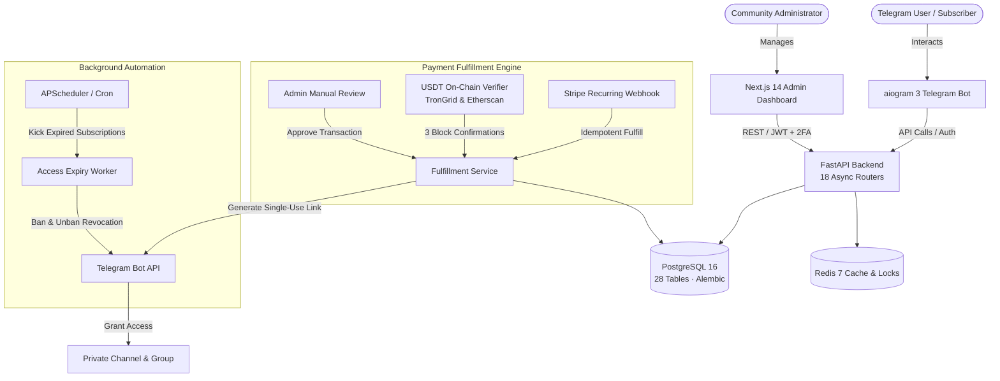

# FastAPI Telegram Subscription SaaS Starter

> Production-grade, full-stack architecture for subscription-based digital communities and membership SaaS. Built with an **18-router async FastAPI backend**, **PostgreSQL 16** (async SQLAlchemy 2 + Alembic), an **aiogram 3 Telegram bot**, and a **Next.js 14 admin dashboard**. Features an **idempotent payment fulfillment engine** supporting **Stripe recurring billing** and **on-chain USDT crypto verification**, with automated single-use invite generation and background access lifecycle enforcement.

[](https://python.org)
[](https://fastapi.tiangolo.com)
[](https://postgresql.org)
[-D71F00)](https://sqlalchemy.org)
[](https://aiogram.dev)
[-black?logo=next.js)](https://nextjs.org)
[](https://docker.com)
[](LICENSE)

---

## Architecture Overview



---

## Key Capabilities

### 1. ⚙️ High-Performance Backend (`backend/`)
- **FastAPI + Async SQLAlchemy 2:** 18 domain routers across authentication, metrics, subscriptions, payments, referrals, broadcasts, support, and audit reconciliation.
- **PostgreSQL 16 & Alembic:** Production schema encompassing 28 tables with indexed queries, strict constraints, and deterministic migrations.
- **JWT & TOTP Two-Factor Authentication:** Granular role-based access control (RBAC) securing administrative endpoints.
- **Structured Observability:** JSON logging via `structlog`, Sentry performance tracking, and live `/health` probes covering database latency and bot heartbeat.

### 2. 💳 Multi-Provider Idempotent Payment Engine
- **Stripe Recurring Billing:** Handles checkout sessions, recurring customer charges, subscription upgrades/cancellations, and automated dispute tracking.
- **On-Chain USDT Crypto Verification:** Native on-chain transaction parser verifying TRC20 (TronGrid) and ERC20 (Etherscan) transfers against recipient addresses with configurable block confirmation thresholds (default 3 confirmations).
- **Single-Entrypoint Fulfillment:** Idempotent `fulfill_payment` handler guarantees zero duplicate grant triggers even during webhook retries or concurrent payment arrivals.
- **Refund & Promo Logic:** Handles full and partial refunds with automatic referral commission recalculation and customizable promo code redemption limits.

### 3. 🤖 Autonomous Community Management Bot (`aiogram 3`)
- **Single-Use Invite Links:** Generates cryptographically secure, single-use invite links into target Telegram channels and chat groups upon verified payment.
- **Automated Expiry Worker (`kick_expired_job`):** Automated background worker that scans expired subscriptions, dispatches renewal warnings 3 days prior, and revokes Telegram access automatically.
- **Affiliate & Referral Engine:** Automated referral links (`?start=ref_<code>`) tracking attribution, tier discounts, and affiliate commission balance payouts.
- **Gifting System:** Users can purchase gift subscriptions with unique redemption claim links.

### 4. 📊 Next.js 14 Administrative Dashboard (`admin/`)
- **Executive Metrics:** Real-time MRR, active subscribers, churn rate, revenue growth charts, top affiliates, and recent transaction streams (built with Recharts and TanStack Query).
- **Comprehensive Management:** Tables for user profiles, active subscriptions, pending crypto transactions, promo codes, broadcast campaigns, and payment reconciliation audits.

### 5. 🚀 Production DevOps & Security (`deploy/`)
- **Docker Compose:** Multi-service orchestration (`api`, `bot`, `admin`, `db`, `redis`, `caddy`) with automated seeding and test profiles.
- **Caddy 2 Reverse Proxy:** Automated Let's Encrypt SSL termination and secure HTTP header hardening.
- **Automated Off-site Encrypted Backups:** Age-encrypted PostgreSQL database backups streaming to S3, Cloudflare R2, or Backblaze B2.

---

## Tech Stack

| Layer | Technology |
|---|---|
| **Bot Service** | Python 3.11 · aiogram 3 · APScheduler |
| **API Backend** | FastAPI · Pydantic 2 · SQLAlchemy 2 (async) · asyncpg · Alembic |
| **Data & Cache** | PostgreSQL 16 · Redis 7 |
| **Payments** | Stripe (Live webhooks) · USDT TRC20/ERC20 (On-chain verifier) · Manual payments |
| **Admin Dashboard** | Next.js 14 (App Router) · TypeScript · Tailwind CSS · TanStack Query · Recharts |
| **Infrastructure** | Docker Compose · Caddy 2 (Auto Let's Encrypt SSL) · structlog · Sentry |

---

## Quick Start (Local Docker Setup)

```bash
# 1. Clone repository
git clone https://github.com/mradurdymyradov/fastapi-telegram-subscription-starter.git
cd fastapi-telegram-subscription-starter/deploy

# 2. Configure environment
cp .env.example .env
# Edit .env and supply your BOT_TOKEN, JWT_SECRET, and database credentials

# 3. Start complete stack with Docker Compose
docker compose -p membership_saas up -d --build

# 4. (Optional) Populate database with demo fixtures
docker compose -p membership_saas --profile seed run --rm seed

# 5. Inspect container logs
docker compose -p membership_saas logs -f api bot
```

### Running Test Suite

The test suite runs with fully mocked external dependencies (no live database or Redis required):

```bash
docker compose -p membership_saas --profile test run --rm test
```

---

## Project Structure

```text
.
├── backend/
│   ├── alembic/                # Database migrations (28 tables)
│   ├── app/
│   │   ├── api/                # 18 FastAPI routers & dependency injection
│   │   ├── bot/                # aiogram 3 handlers, keyboards, middlewares
│   │   ├── db/                 # Async SQLAlchemy models and sessions
│   │   ├── observability/      # structlog JSON logging & Sentry setup
│   │   ├── ops/                # Expiration workers & operational gates
│   │   ├── payments/           # Stripe, USDT verifier, manual payment logic
│   │   └── services/           # Channel access, invite links, gifts, webhooks
│   ├── tests/                  # Pytest unit and integration test suite
│   ├── Dockerfile
│   └── pyproject.toml
├── admin/                      # Next.js 14 Admin Panel
│   ├── app/                    # App Router dashboard pages
│   ├── components/             # Reusable UI components & metrics charts
│   ├── lib/                    # API client & queries
│   ├── Dockerfile
│   └── package.json
├── deploy/
│   ├── backup/                 # Encrypted backup & verification scripts
│   ├── Caddyfile               # Caddy reverse proxy configuration
│   ├── docker-compose.yml      # Multi-service production stack
│   └── .env.example            # Documented environment template
├── docs/                       # Architecture documentation and runbooks
│   ├── ARCHITECTURE.md
│   └── runbooks/
├── LICENSE                     # MIT License
└── README.md
```

---

## Architectural Deep Dive

For detailed system topology, database relational models, and idempotent payment state diagrams, see [`docs/ARCHITECTURE.md`](./docs/ARCHITECTURE.md).

---

## License

This project is licensed under the MIT License — see the [LICENSE](LICENSE) file for details.
